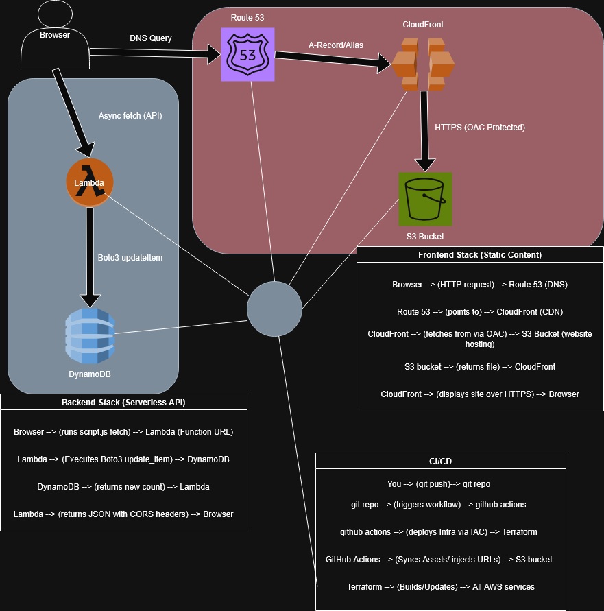

AWS Cloud Resume

A full-stack, serverless resume website built on AWS using Infrastructure as Code (Terraform) and automated through a CI/CD pipeline.

Live Demo: thedonaldtong.com

Cloud Resume Infrastructure 

🏗️ Architecture Overview

The project follows a serverless, highly-available architecture designed for global performance, security, and dynamic functionality.

    Frontend: HTML5, CSS3, and JavaScript hosted on Amazon S3.

    Dynamic Backend: A visitor counter powered by AWS Lambda (Python/Boto3) using Lambda Function URLs for a direct HTTPS endpoint.

    Database: Amazon DynamoDB stores and persists the live visitor count.

    DNS & Routing: Amazon Route 53 manages global traffic for both the apex domain and www subdomain.

    Content Delivery: Amazon CloudFront serves as the CDN to deliver content via edge locations with low latency.

    Infrastructure as Code: Terraform manages the entire AWS lifecycle as a single source of truth.

    CI/CD: GitHub Actions automates infrastructure updates, content synchronization, and CloudFront cache invalidation. GitHub Secrets for secure AWS credential management

DNS & Domain Management

    Apex & Subdomain Support: Configured Route 53 with Alias records for both thedonaldtong.com and www.thedonaldtong.com, ensuring seamless redirection and a professional user experience.

 Serverless Visitor Counter (Lean Architecture)

    Lambda Function URLs: Implemented a direct HTTPS endpoint for the Python backend, removing the overhead of API Gateway while maintaining secure communication.

    Atomic Increments: Utilized boto3 to perform atomic updates in DynamoDB, ensuring the visitor count remains accurate even during concurrent page loads.

    Frontend Integration: Used the JavaScript Fetch API to asynchronously retrieve and display the live counter data.

 Security-First Approach

    Origin Access Control (OAC): Secured the S3 bucket to prevent public access; the bucket only accepts requests signed by the CloudFront distribution.

    CORS Hardening: Restricted API access to my specific domain to prevent unauthorized cross-origin requests.

    IAM Least Privilege: Configured a granular IAM execution role for Lambda, restricting database access to a single DynamoDB table and specific actions (GetItem, UpdateItem).
